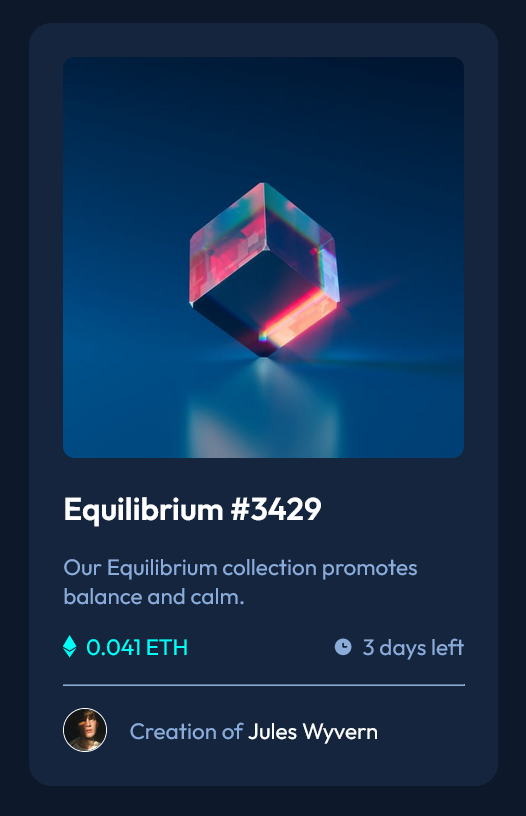

# Frontend Mentor - NFT preview card component solution

This is a solution to the [NFT preview card component challenge on Frontend Mentor](https://www.frontendmentor.io/challenges/nft-preview-card-component-SbdUL_w0U). Frontend Mentor challenges help you improve your coding skills by building realistic projects.

## Table of contents

- [Overview](#overview)
  - [The challenge](#the-challenge)
  - [Screenshot](#screenshot)
  - [Links](#links)
- [My process](#my-process)
  - [Built with](#built-with)
  - [What I learned](#what-i-learned)
  - [Continued development](#continued-development)
  - [Useful resources](#useful-resources)
- [Author](#author)
- [Acknowledgments](#acknowledgments)

**Note: Delete this note and update the table of contents based on what sections you keep.**

## Overview

Exercise to build out the preview card component and get it looking as close to the design as possible.

### The challenge

Users should be able to:

- View the optimal layout depending on their device's screen size
- See hover states for interactive elements

### Screenshot

### Links

- Solution URL: [Add solution URL here]([https://your-solution-url.com](https://github.com/Gunner40/nft-preview-card-component))
- Live Site URL: [Add live site URL here](https://your-live-site-url.com)

## My process

1. Study the design and plan out HTML structure and class names
2. Code the HTML
3. Code the CSS

### Built with

- Semantic HTML5 markup
- CSS custom properties
- Flexbox
- Mobile-first workflow

### What I learned

Worked with SVG's.

### Continued development

Revision of React and CSS Grid so I can use them in future projects.

## Author

- Paul Ryan
- Frontend Mentor - [@Gunner40](https://www.frontendmentor.io/profile/Gunner40)
